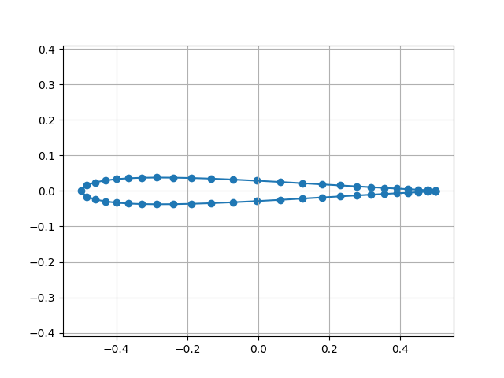
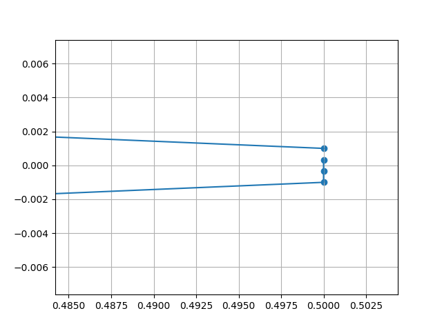
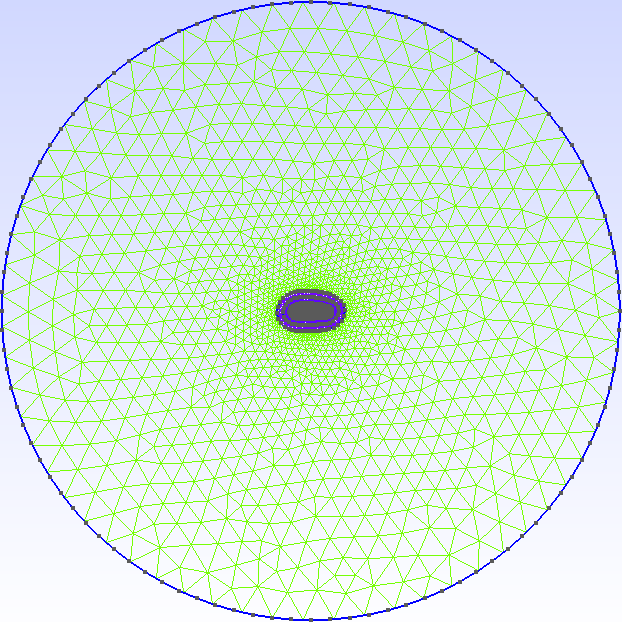
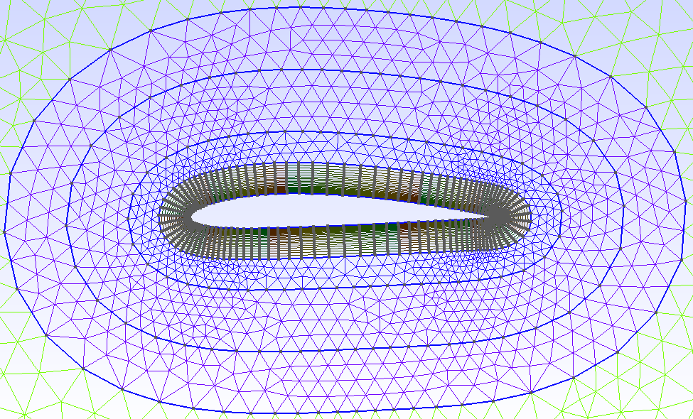
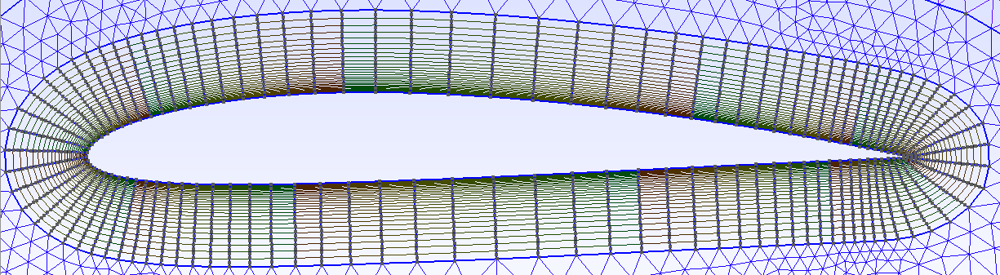
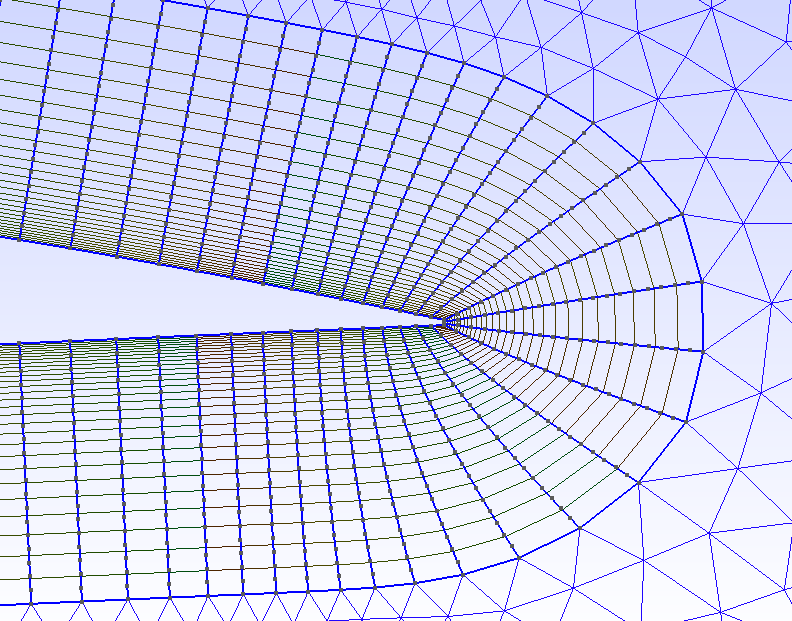

# airfoil-mesh

Python script that creates a mesh around an airfoil to be used in CFD analysis.

## How to use it

```python

# import or copy the airfoil_mesh class

file = "file.txt"
ns = 100
nt = 5
nf = 30
delta = 0.1
exp1 = 1.1
exp2 = 1.1
exp3 = 1.1
ext_radius = 10.0
ext_cell_size = 1.0

out_file = "file.msh"

# initialize class
mesh = airfoil_mesh(file=file,
                    ns=ns, nt=nt, nf=nf,
                    delta=delta,
                    exp1=exp1, exp2=exp2, exp3=exp3,                    
                    ext_radius=ext_radius,             
                    ext_cell_size=ext_cell_size)

# some of the input can be replaced
mesh.build_surface()

# view the surface in a matplotlib plot
mesh.show_surface()

# must be called after mesh.build_surface()
# some of the input can be replaced
mesh.build_mesh(out_file)

```

## Meshes

### 1. Output of 'mesh.show_surface()'

Full view and a zoom at the trailing edge.

<p float="left">
  
  
</p>

### 2. Output when 'gmsh_view' is set to True in 'mesh.build_mesh()'

<p float="left">
  
  
</p>

<p float="left">
  
  
</p>